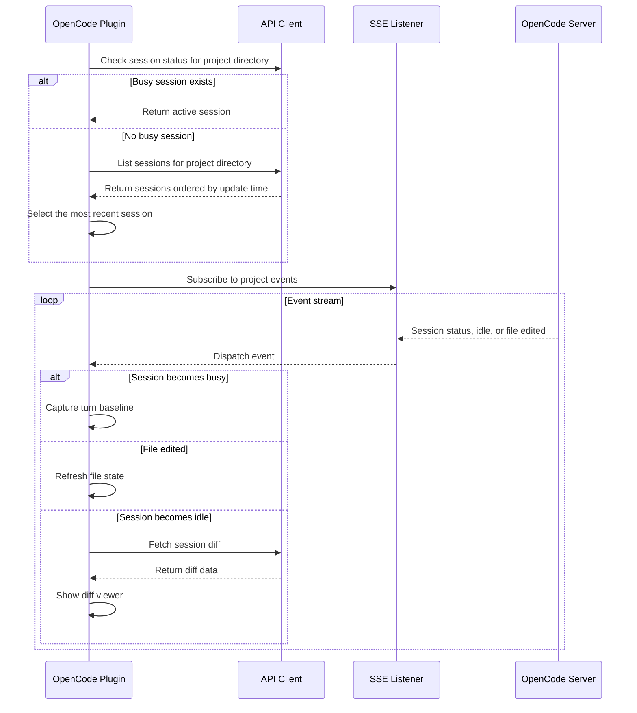

# OpenCode JetBrains Plugin: Base Feature Design

## Overview

This document describes the user experience and technical design of the OpenCode JetBrains plugin's base features.

## Implemented Features

### 1. Quick Launch

| Platform | Shortcut |
|----------|----------|
| macOS | `Cmd + Esc` |
| Windows/Linux | `Ctrl + \` |

The connection dialog lets users connect to an existing server or start a local terminal session.

- Server address format: `host:port`; the default local address is `127.0.0.1:4096`.
- OpenCode CLI versions are detected automatically. CLI v2 requires a server password.
- Passwords can be remembered in the IDE Password Safe using the **Remember password** option.
- Credentials are passed to the CLI and plugin API clients for authenticated connections.
- For a server hosted in WSL or on another machine, enter an address reachable from the IDE host.
- Prefer `127.0.0.1` to `localhost` on Windows systems where `localhost` may resolve to IPv6.
- The plugin does not start a terminal automatically when the IDE starts; a user action is required.

### 2. Add Context to the OpenCode Terminal

| Platform | Shortcut |
|----------|----------|
| macOS | `Opt + Cmd + K` |
| Windows/Linux | `Ctrl + Alt + K` |

- Editor selection: sends a project-relative reference such as `@path/to/file.kt#L10-25`.
- Editor without a selection: sends a reference to the current file.
- Project View selection: sends a reference for each selected file or directory.
- References use forward slashes and paths relative to the project.
- If the terminal is not open, the action creates or focuses it before sending the context.

### 3. Sidebar Icon

The OpenCode icon in the IDE sidebar invokes Quick Launch, focusing an existing session or opening the connection dialog.

## Architecture

```text
OpenCodeService (project service)
├── Connection and process lifecycle
├── OpenCode API and SSE coordination
├── Terminal and web UI lifecycle
└── Diff collection and review

OpenCodeConnectDialog
├── Server address and password input
├── Optional secure password remembering
└── Custom working directory

SessionManager
├── Session and turn state
├── File snapshots and change attribution
└── Diff processing, accept, and reject

DiffViewerService
└── Multi-file IDE diff viewer and review actions
```

### Session and API Event Flow

The plugin combines API polling for recovery with SSE for real-time updates. Events are scoped to the project directory.



### Key Components

- `OpenCodeService`: Project-scoped connection, process, terminal, and event lifecycle.
- `OpenCodeConnectDialog`: Address, password, and working-directory configuration.
- `ProcessAuthDetector`: Attempts to detect authentication for an existing local server.
- `OpenCodeApiClient` and `SseEventListener`: Authenticated HTTP and event-stream clients.
- `SessionManager`: Tracks turns, file state, and diff operations.
- `OpenCodeTerminalVirtualFile` and `OpenCodeTerminalFileEditor`: Show a terminal in an editor tab.

## Test Scenarios

1. Quick Launch focuses an existing OpenCode session or opens the connection dialog.
2. Adding context without an editor selection sends the current file reference.
3. Adding context with a selection includes the selected line range.
4. Project View multi-selection sends a reference for every selected entry.
5. The sidebar icon invokes Quick Launch.
6. Closing the terminal tab cleans up the associated connection state.
