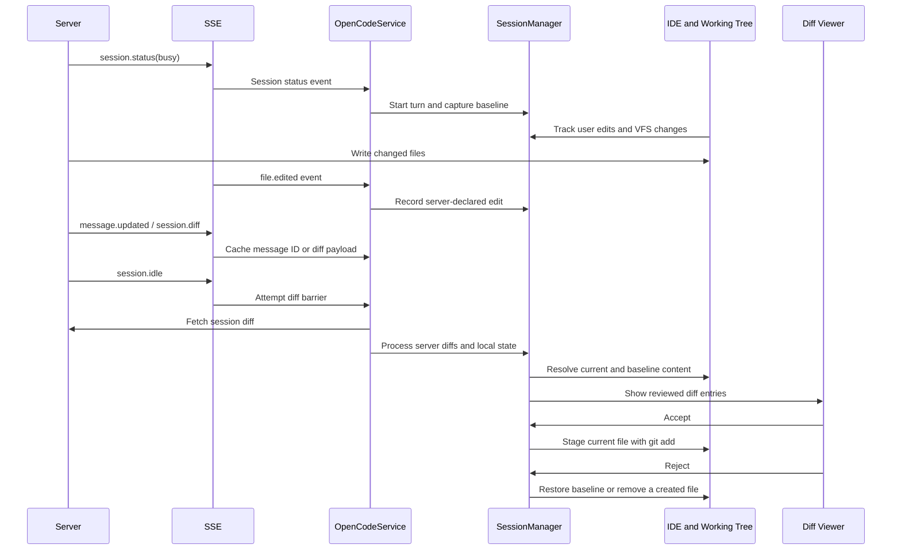

# OpenCode JetBrains Diff Feature Design

## Overview

This document describes the plugin's diff workflow. The working tree is the source of truth. Explicit `file.edited` events and IDE document/VFS events help attribute changes, while Local History provides a recovery baseline.

The plugin uses local Git and file operations for review actions rather than depending exclusively on a server-side revert API.

## Architecture and Data Flow



## Diff Collection and Display

The diff workflow is triggered by session transitions from busy to idle and `session.idle` events. A barrier coordinates idle status with a message ID or an SSE diff payload before fetching and processing changes.

### Server Data and Local Recovery

- Prefer diffs returned by the server, but filter stale or unchanged content.
- Compare server data with VFS events and captured file state to identify missing or stale diffs.
- Use local state to rescue server-omitted changes only when there is sufficient evidence that the file belongs to the current AI turn.
- Keep separate signals for VFS changes, server-declared edits, and user edits.
- Synchronize changes made between turns before capturing the next turn's baseline.

### Baseline Resolution

Resolve the original file content using this fallback order:

1. Content captured before the turn (`capturedBeforeContent`).
2. Local History at the turn-start label.
3. The in-memory known-state snapshot.
4. Disk fallback only for a server-declared deletion whose `before` content is empty.
5. Server-provided `before` content when local sources cannot provide a baseline.

Filter entries with no substantive change, while allowing verified VFS rescue to recover a real change that the server reported as unchanged.

## Accept and Reject

### Accept

Stage the current working-tree content with `git add <file>` (or `git add -A <file>` where needed). Clear pending diff state only after the operation succeeds.

### Reject

Restore the file to its pre-turn state, preferring Local History and falling back to a known snapshot or server-provided original content. Physically remove a newly created file when appropriate.

If a file also contains user edits, warn before discarding those changes. Do not report success when the restore or Git operation fails.

Accept and reject operations should run asynchronously. Completion callbacks should be dispatched on the EDT so the UI can be updated safely.

## Attribution and Rescue Rules

`SessionManager` tracks distinct sources of change:

- `vfsChangedFiles`: physical file changes observed by the IDE.
- `serverEditedFiles`: files explicitly declared through `file.edited` events.
- `userEditedFiles`: edits made by the user in the IDE.
- `aiCreatedFiles`: files observed as newly created during the AI operation.
- `capturedBeforeContent`: original content captured before a change.

Rescue should be conservative to avoid attributing user work to the AI:

| Case | Evidence required |
|------|-------------------|
| Deleted file | Captured original content or a server `file.edited` claim |
| New file | IDE creation event and server `file.edited` claim |
| Modified file missing from server diff | Server `file.edited` claim |

Do not synthesize an AI diff for a file explicitly identified as user-edited during the turn. Discard ghost diffs where resolved before-content is identical to the current content.

## Turn Lifecycle

```text
Turn start (busy)
  → Increment turn number and mark busy
  → Clear per-turn user edit state
  → Synchronize gap-period changes
  → Capture known state and Local History baseline

During turn
  → Record server-declared file edits
  → Track VFS changes and new files
  → Track user edits independently

Turn end (idle)
  → Mark not busy and create an immutable TurnSnapshot
  → Rotate event collections for gap-period capture
  → Resolve the server diff and display processed entries
```

`TurnSnapshot` should capture the turn number, edited/created/user-edited file sets, baseline label, and known file states so diff processing uses a stable view of the turn.

## Strategy Matrix

| Scenario | OpenCode action | User action | Review behavior | Reject behavior |
|----------|-----------------|-------------|-----------------|-----------------|
| Existing file changed | Edited | None | Normal diff | Restore baseline |
| Existing file changed | Edited | Edited | Warn about user changes | Warn, then restore |
| Server diff only | No VFS event yet | None | Use server diff | Restore server `before` content |
| New file created | Created | Edited | Warn about mixed changes | Warn, then delete if confirmed |

## Known Issues and Mitigations

- **Missing message ID:** Use the barrier timeout and available SSE payload or session data as a fallback.
- **Non-ASCII filenames:** Ensure the file-diff deserializer handles server path encoding.
- **Local History lookup failure:** Fall back to known state and then server-provided `before` content, respecting deletion safety.
- **Ghost diffs:** Filter unchanged content, but do not suppress verified rescued changes.
- **Late baseline race:** Retain and rotate gap-period VFS events so changes between turns are not lost.

## Data Model

```kotlin
data class DiffEntry(
    val file: String,
    val diff: FileDiff,
    val hasUserEdits: Boolean = false,
    val resolvedBefore: String? = null,
    val isCreatedExplicitly: Boolean = false
) {
    val isNewFile: Boolean get() = isCreatedExplicitly && diff.before.isEmpty()
    val beforeContent: String get() = resolvedBefore ?: diff.before
}
```

## Future Work

Current attribution is file-level. Hunk-level or three-way attribution could distinguish user edits from AI edits within the same file, provided reliable server-side content or local offset tracking is available.
