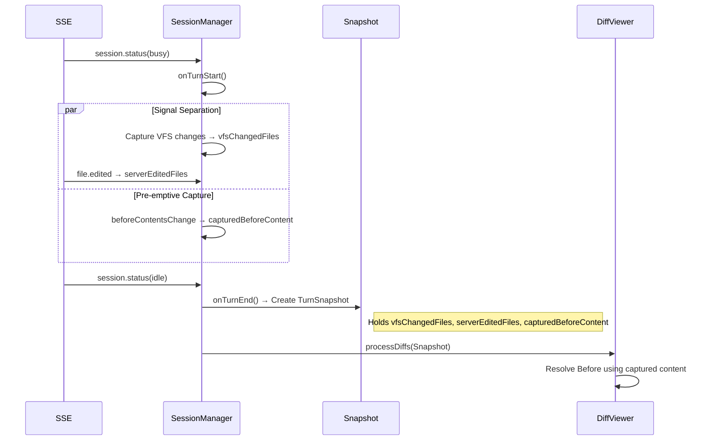

# OpenCode Plugin Testing Strategy

This document describes the testing strategy for the OpenCode JetBrains plugin, including the automated test architecture, core business-logic coverage, and manual regression cases.

---

## Part 1: Automated Testing

The project uses a layered testing approach to verify feature correctness and stability, with particular attention to Turn isolation and race conditions in the Diff workflow.

### Test Architecture

```text
Layer 3: Real IDE + Real OpenCode Server (RealProcessIntegrationTest)
Layer 1: Mock IDE + Fake Server (OpenCodeLogicTest)
```

### 1. Logic Tests (`OpenCodeLogicTest`)

**Location**: `src/test/kotlin/ai/opencode/ide/jetbrains/integration/OpenCodeLogicTest.kt`

**Purpose**: Verify core business logic in a controlled environment, especially concurrent and state-management scenarios.

**Key components**:

- **Mock IDE**: Uses Java proxies to simulate `Project` and IntelliJ Platform components.
- **Fake Server**: A lightweight Java HTTP server that simulates the OpenCode backend API and SSE event stream.

**Covered Turn scenarios**:

| Scenario | Description | Verification |
| :--- | :--- | :--- |
| **Scenario A: Normal Turn** | Standard Busy → File Edited → Idle flow | Verifies that a basic modification Diff is displayed correctly. |
| **Scenario C: Turn Isolation** | Turn 2 starts immediately after Turn 1 ends | Verifies that Turn 1 Diffs do not contaminate Turn 2 (Gap Event Filtering). |
| **Scenario F: New File Safety** | AI creates a new file | Verifies that the new file's Before content resolves to empty instead of reading its new disk contents and losing the Diff. |
| **Scenario G: User Edit Safety** | User edits a file while a VFS change occurs | Verifies that the AI Diff is strictly filtered when the user edits the file while the AI is working (User Priority). |
| **Scenario L: Rescue Deletion** | Server omits a change and the file is physically deleted | Verifies that captured original content (Captured/KnownState) can recover and display the Diff. |
| **Scenario N: Server Authoritative** | Server Diff arrives without a VFS signal | Verifies that a Diff is displayed when the server declares the edit, even if VFS did not detect it (for example, a remote modification). |
| **Scenario O: Create then Modify** | A file is created in one Turn and modified in a later Turn | Verifies that Pre-Filter and Rescue correctly handle stale server data, avoiding the loss of a real modification when `Before == After`. |

### 2. Real Process Integration Tests (`RealProcessIntegrationTest`)

**Location**: `src/test/kotlin/ai/opencode/ide/jetbrains/integration/RealProcessIntegrationTest.kt`

**Purpose**: Verify compatibility between the plugin and a **real OpenCode executable**.

**Verification points**:

- **Connection**: Automatically discovers and starts `opencode serve`, then establishes real SSE and HTTP connections.
- **Accept**: Simulates an AI file modification, selects **Accept**, and verifies that the file is correctly staged with `git add`.
- **Reject**: Simulates an AI file modification, selects **Reject**, and verifies that the file is restored correctly.
- **File operations**: Covers edge cases such as deleting files, creating files, and modifying empty files.

### 3. Running Tests

```bash
# Run all tests
./gradlew test

# Run a specific test class
./gradlew test --tests "ai.opencode.ide.jetbrains.integration.OpenCodeLogicTest"
```

---

## Part 2: Turn Scenario Analysis

This section describes the internal logic flow for Turn isolation.

### Core Data Flow (2026-01-24 Update)



### Key Mechanisms

1. **TurnSnapshot**: An immutable snapshot is created when a Turn ends. Subsequent Diff fetching and processing rely on this snapshot.
2. **Signal Separation**: Physical VFS changes and logical server claims are tracked separately. Rescue uses their intersection where appropriate to avoid misattributing user actions.
3. **Pre-emptive Capture**: VFS events capture file content before a change, addressing timing races.
4. **Safe Rescue**: Rescue logic uses strict Ghost Diff protections and does not invent changes without evidence.

---

## Part 3: Manual Test Cases

### Environment Setup

1. Run the plugin: `./gradlew runIde`
2. Start the OpenCode CLI.

### TC-01: Basic Diff Display

**Steps**: Ask the AI to modify a file.

**Expected**: The Diff window opens and displays the changes.

### TC-02: Delete a File

**Steps**: Ask the AI to delete a file.

**Expected**: The Diff window opens and shows the file deletion. Selecting **Reject** restores the file.

### TC-03: Create a File

**Steps**: Ask the AI to create a file.

**Expected**: The Diff window opens. Selecting **Reject** physically deletes the new file.

### TC-04: Modify an Empty File

**Steps**: Create an empty `empty.txt` file and ask the AI to modify it.

**Expected**: The Diff window opens. Selecting **Reject** clears the file contents without deleting the file.

### TC-05: Replace a File

**Steps**: Ask the AI to delete a file and create another file with the same name.

**Expected**: **Reject** restores the original file contents.

### TC-06: Rapid Consecutive Conversations

**Steps**: Send a message that modifies file A, then immediately send another message that modifies file B before the Diff opens.

**Expected**: Diffs for both A and B are eventually shown, separately or together; neither is lost.

---

## Maintenance Guide

- **When changing `SessionManager`**: Run `OpenCodeLogicTest`.
- **When upgrading OpenCode**: Run `RealProcessIntegrationTest`.
